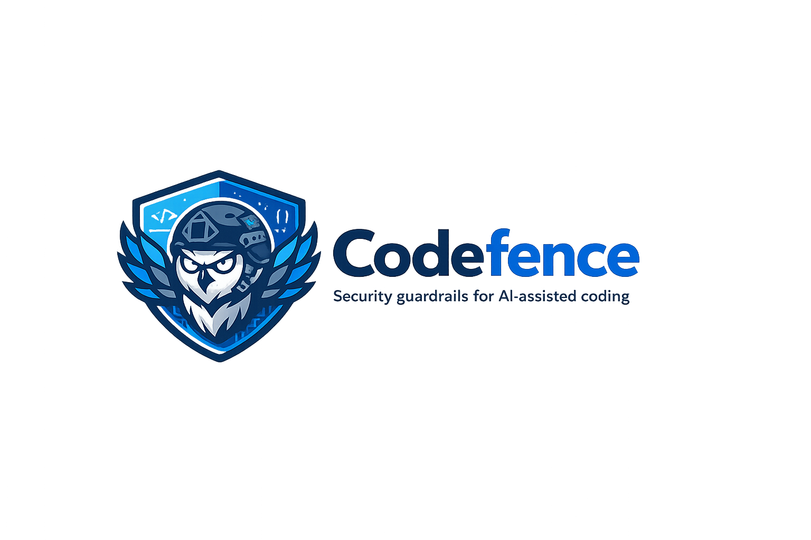

<p align="center"></p>

# Codefence

**Codefence** - guardrails for AI-assisted coding.

- **npm:** [`codefence`](https://www.npmjs.com/package/codefence)
- **CLI:** `codefence`

## What this project provides

- `codefence scan` — local security scanning on git-changed or explicit paths (secrets and dependency vulnerabilities)
- Integrations for Cursor, Claude Code, and GitHub Copilot
- Cross-platform Git pre-commit hook and optional IDE background scanning (`codefence install-hooks`)

## Prerequisites

- [Node.js](https://nodejs.org/) 18+

## Install (consumers)

```bash
npm install -D codefence
```

```json
{
  "scripts": {
    "codefence": "codefence scan --staged"
  }
}
```

```bash
npm run codefence
```

Global or one-off:

```bash
npm install -g codefence
codefence scan --staged

npx --package=codefence codefence scan --staged
```

### From GitHub

```json
"devDependencies": {
  "codefence": "github:kadraman/codefence"
}
```

## Setup (this repository)

```bash
npm install
npm run build
npm run codefence
```

See [CONTRIBUTING.md](CONTRIBUTING.md) for development and npm publish.

## Using codefence in another project

### Recommended: npm package

```json
{
  "devDependencies": {
    "codefence": "^1.0.0"
  },
  "scripts": {
    "codefence": "codefence scan --staged"
  }
}
```

After `npm install`, the `codefence` binary is linked from `node_modules/.bin/`. The CLI uses your application repo as the working directory.

### Non-JavaScript / non-npm projects

You need Node.js and Git; the app repo does not need its own `package.json`.

```bash
npm install -g codefence
codefence scan --staged
```

Or without global install:

```bash
npx --package=codefence codefence scan --staged
```

Pre-commit: `codefence install-hooks`.

### Other install options

| Approach | When to use |
| -------- | ----------- |
| **npm devDependency** | Node apps |
| **Global `codefence`** | Python, Java, Go, etc. |
| **`npx`** | Hooks without global install |
| **`npm link`** | Local development — [CONTRIBUTING.md](CONTRIBUTING.md) |

## The `scan` command

```bash
codefence scan --staged
codefence scan --paths src/app.ts
codefence scan --help
```

| Option | Description |
| ------ | ----------- |
| `--staged` | Scan staged git files instead of unstaged changes |
| `--paths <files…>` | Scan explicit paths (bypasses git-changed discovery) |
| `--only code,deps` | Run only listed aspects (`code`, `deps`) |
| `--skip code,deps` | Skip selected aspects |
| `--deps-provider <osv\|custom>` | Select dependency vulnerability provider (default: `osv`) |
| `--deps-provider-url <url>` | Override dependency provider API endpoint |
| `--deps-refresh` | Ignore dependency cache and query provider again |
| `--deps-cache-ttl <duration>` | Set dependency result cache TTL |
| `--deps-timeout <duration>` | Set dependency provider request timeout |
| `--deps-http2 <auto\|on\|off>` | Set dependency transport preference |
| `--secret-rules <path…>` | Load Semgrep-style YAML secret rules from files or directories |
| `--secret-default-rules <on\|off>` | Enable or disable bundled secret rules |
| `--secret-rules-update-url <url>` | Download and cache a remote YAML rule bundle |
| `--secret-rules-refresh` | Force remote rule refresh before scanning |
| `--secret-entropy-threshold <number>` | Tune entropy-based secret detection sensitivity |
| `--secret-min-length <number>` | Ignore short candidates during entropy analysis |
| `--secret-min-confidence <low\|medium\|high>` | Filter lower-confidence secret findings |

Git-based scans skip fixture trees such as `examples/` (see `codefence scan --help`). Explicit `--paths` still scans those files.

Built-in secret scanning now combines:

- a bundled Semgrep-style YAML pack at `rules/secret/builtin.yml` (version `2026-05-25`) for common tokens, private keys, password-like assignments, and URI credentials
- Semgrep-style YAML rule loading from local files or directories
- entropy-based detection for unknown secret formats
- deduplicated findings with confidence and evidence summaries

Sample fixtures and a downloadable example rule bundle are in [`examples/`](examples/README.md).

```bash
codefence scan --staged --secret-rules .codefence/rules/secrets
codefence scan --paths examples/secrets
codefence scan --paths src config --secret-entropy-threshold 4.2 --secret-min-confidence medium
codefence scan --paths examples/secrets --secret-rules-update-url http://127.0.0.1:8765/extra-secrets-bundle.yml --secret-rules-refresh
```

Serve the example remote bundle locally (`examples/rules/README.md`):

```bash
npx --yes serve examples/rules -l 8765
```

Remote rule bundles are cached under `.codefence/cache/secret-rules/` for offline and low-latency scans. Use `--secret-rules-refresh` or `CODEFENCE_SECRET_RULES_REFRESH=1` to force a re-download before scanning.

**Environment:** `CODEFENCE_ASPECTS`, `CODEFENCE_ONLY`, `CODEFENCE_SKIP`, `CODEFENCE_DEPS_PROVIDER`, `CODEFENCE_DEPS_PROVIDER_URL`, `CODEFENCE_DEPS_REFRESH`, `CODEFENCE_DEPS_CACHE_TTL`, `CODEFENCE_DEPS_TIMEOUT`, `CODEFENCE_DEPS_HTTP2`, `CODEFENCE_SECRET_RULES`, `CODEFENCE_SECRET_DEFAULT_RULES`, `CODEFENCE_SECRET_DEFAULT_RULES_VERSION`, `CODEFENCE_SECRET_RULES_UPDATE_URL`, `CODEFENCE_SECRET_RULES_REFRESH`, `CODEFENCE_SECRET_RULES_CACHE_TTL`, `CODEFENCE_SECRET_ENTROPY_THRESHOLD`, `CODEFENCE_SECRET_MIN_LENGTH`, `CODEFENCE_SECRET_MIN_CONFIDENCE`.

## Git pre-commit and background scanning

```bash
codefence install-hooks
```

See **[docs/HOOKS.md](docs/HOOKS.md)** for testing (`codefence pre-commit`, `codefence background-scan`, cache, bypass).

| Command | Purpose |
| ------- | ------- |
| `codefence install-hooks` | Install Node-based `.git/hooks/pre-commit` + IDE `hooks.json` (if missing) |
| `codefence pre-commit` | Run the same check as Git (without committing) |
| `codefence background-scan --file path` | Queue debounced local scan (IDE / manual) |

## AI assistant integrations (Cursor, Claude, Copilot)

In **each application repo**, run:

```bash
codefence install
```

This merges secrets guardrail instructions **without overwriting** your existing `AGENTS.md`, Claude/Copilot files, or other Cursor rules. It adds `.cursor/rules/codefence-guardrails.mdc` as a separate rule file and appends `.codefence/` to `.gitignore` when needed.

```bash
codefence install --dry-run   # preview
```

**Setup guide:** [docs/AI-ASSISTANTS.md](docs/AI-ASSISTANTS.md)

## CLI commands (summary)

| Command | Purpose |
| ------- | ------- |
| `codefence scan` | Run local security aspects (secrets and dependency vulnerabilities) |
| `codefence pre-commit` | Same checks as the Git pre-commit hook |
| `codefence install-hooks` | Install `.git/hooks/pre-commit` + optional IDE background scan config |
| `codefence install` | Merge AI assistant instructions (non-destructive) |
| `codefence background-scan` | Queue a debounced background scan (IDE / manual) |

Hook details: [docs/HOOKS.md](docs/HOOKS.md).

## Documentation

| Document | Contents |
| -------- | -------- |
| [README.md](README.md) | Install, `codefence scan`, release |
| [docs/AI-ASSISTANTS.md](docs/AI-ASSISTANTS.md) | Cursor, Claude, Copilot, `codefence install` |
| [docs/HOOKS.md](docs/HOOKS.md) | Git pre-commit, background scanner, cache |
| [docs/README.md](docs/README.md) | Documentation index |
| [CONTRIBUTING.md](CONTRIBUTING.md) | Development, tests, npm publish |

## Development and release

| Topic | Document |
| ----- | -------- |
| Local setup, `npm link`, PRs | [CONTRIBUTING.md](CONTRIBUTING.md#development-setup) |
| `npm publish`, tags, CI | [CONTRIBUTING.md](CONTRIBUTING.md#release-and-publish-to-npm) |

```bash
npm ci && npm test
npm version patch
git push origin main --tags
npm publish --access public
```

## License

See [LICENSE](LICENSE).
