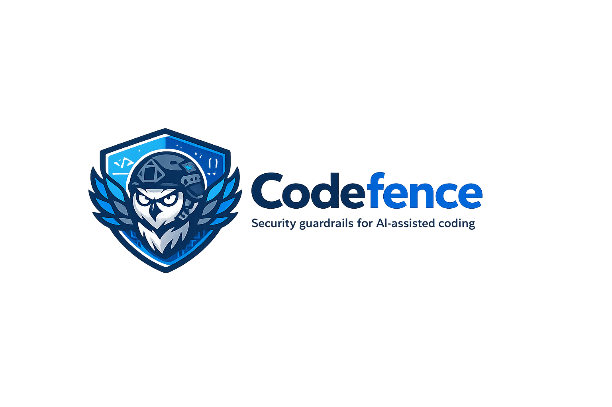

<p align="center"></p>

# Codefence

**Codefence** is a security scanning CLI that provides guardrails for AI-assisted coding. It scans git-changed or explicit paths for secrets and dependency vulnerabilities to help prevent secret exposure (through context pasting or session persistence), vulnerable recommendations, or hallucinated packages. Integrations are available for Cursor, Claude Code, and GitHub Copilot, plus a cross-platform Git pre-commit hook, optional IDE background scanning (`codefence install-hooks`), and an MCP server (`codefence mcp`) for agent tool calls.

Planned scope (MVP vs later): **[docs/roadmap.md](docs/roadmap.md)**.

## Prerequisites

- A [Go](https://go.dev/dl/) toolchain
- [Git](https://git-scm.com/) (for `--staged` / changed-file discovery)

## Install

### From source (this repository)

```bash
git clone https://github.com/kadraman/codefence.git
cd codefence
CGO_ENABLED=0 go build -trimpath -ldflags="-s -w" -o codefence ./cmd/codefence
```

Put the resulting `codefence` binary on your `PATH`, or run it from the build directory.

### With `go install`

```bash
go install github.com/kadraman/codefence/cmd/codefence@latest
```

Ensure `$(go env GOPATH)/bin` is on your `PATH`, then:

```bash
codefence scan --staged
```

### Setup (contributors)

```bash
go test ./...
CGO_ENABLED=0 go build -trimpath -ldflags="-s -w" -o codefence ./cmd/codefence
./codefence scan --staged
```

Engineering specs and process: [`specs/README.md`](specs/README.md). Test gates: [`specs/global/testing.md`](specs/global/testing.md).

## Using codefence in another project

Install the binary (build or `go install` above), then from your application repo:

```bash
codefence scan --staged
```

Pre-commit and IDE hooks: `codefence install-hooks` (requires `codefence` on `PATH`). AI assistant guardrails: `codefence install`.

| Approach | When to use |
| -------- | ----------- |
| **`go install …@latest`** | Consumers who want the binary on `GOPATH/bin` |
| **Release / local build** | Pin a known binary; CI images |
| **`PATH` to a built binary** | Hooks, agents, and local development |

## The `scan` command

```bash
codefence scan --staged
codefence scan --paths src/app.go
codefence scan --help
```

| Option | Description |
| ------ | ----------- |
| `--staged` | Scan staged git files instead of unstaged changes |
| `--paths <files…>` | Scan explicit paths (bypasses git-changed discovery) |
| `--only code,deps` | Run only listed aspects (default: `code`; `deps` auto-runs when dependency manifests are in scope) |
| `--skip code,deps` | Skip selected aspects |
| `--format <table\|json>` | Output findings as a table (default) or NDJSON (one JSON object per line on stdout) |
| `--quiet` | Suppress progress and human messages (default with `--format json`) |
| `--verbose` | Show progress on stderr even with `--format json` |
| `--deps-provider <osv\|custom>` | Select dependency vulnerability provider (default: `osv`) |
| `--deps-provider-url <url>` | Override dependency provider API endpoint |
| `--deps-refresh` | Ignore dependency cache and query provider again |
| `--deps-cache-ttl <duration>` | Set dependency result cache TTL |
| `--deps-timeout <duration>` | Set dependency provider request timeout |
| `--deps-http2 <auto\|on\|off>` | HTTP/2 for deps API (`auto` / `on` / `off`) |
| `--deps-scope <changed\|tree>` | Dependency manifest scope: `changed` (git/`--paths`, default) or `tree` (discover all manifests under repo or `--paths` roots) |
| `--secret-rules <path…>` | Load Semgrep-style YAML secret rules from files or directories |
| `--secret-default-rules <on\|off>` | Enable or disable bundled secret rules |
| `--secret-rules-update-url <url>` | Download and cache a remote YAML rule bundle |
| `--secret-rules-refresh` | Force remote rule refresh before scanning |
| `--secret-entropy-threshold <number>` | Tune entropy-based secret detection sensitivity |
| `--secret-min-length <number>` | Ignore short candidates during entropy analysis |
| `--secret-min-confidence <low\|medium\|high>` | Filter lower-confidence secret findings |

Git-based scans skip fixture trees such as `examples/` (see `codefence scan --help`). Explicit `--paths` still scans those files.

Dependency extraction (MVP: npm for JS/TS, and Go) prefers resolved versions from lockfiles when they are in scope (`package-lock.json` / `yarn.lock` / `pnpm-lock.yaml`; Go via `go.mod`). Manifest-only pins work for exact versions in `package.json`. See [dependency-support.md](docs/dependency-support.md).

For the MVP ecosystem matrix (trigger vs extraction), see **[docs/dependency-support.md](docs/dependency-support.md)**.

### Repository config (`codefence-config.yml`)

Define repository-local defaults in `codefence-config.yml` (repo root).
Starter template: [`examples/codefence-config.yml.example`](examples/codefence-config.yml.example).

Precedence order:

1. CLI flags
2. `CODEFENCE_*` environment variables
3. `codefence-config.yml`
4. Built-in defaults

Example:

```yaml
version: 1
scan:
  aspects: [code]
  format: table
paths:
  git_ignored_prefixes:
    - examples/
deps:
  scope: changed
secret:
  min_confidence: low
```

### Full-repository dependency scan (`--deps-scope tree`)

By default, dependency scanning only considers manifests that appear in the **git change set** or in explicit `--paths`. That matches pre-commit and PR workflows but skips unchanged lockfiles and does not walk `yarn.lock` when you only pass `--paths .` (code scans use source extensions, not all manifest types).

Use **`--deps-scope tree`** to discover every dependency manifest under the repository (or under each `--paths` directory) for ecosystems in the v1 matrix (see [dependency-support.md](docs/dependency-support.md)). Common vendor directories (`node_modules`, `.git`, `.codefence`, etc.) are skipped.

```bash
# Audit all dependency manifests in the repo (deps aspect only)
codefence scan --only deps --deps-scope tree

# Same, force a fresh OSV lookup
codefence scan --only deps --deps-scope tree --deps-refresh

# Limit tree walk to a subtree
codefence scan --only deps --deps-scope tree --paths examples/deps
```

With `--deps-scope tree` and no `--only`, Codefence still runs **code** on git-changed files and **deps** on every discovered manifest. Set `CODEFENCE_DEPS_SCOPE=tree` to make tree scope the default for deps.

### Finding severity

All aspects emit findings with one of four severity levels: `critical`, `high`, `medium`, `low` (table output and `--format json`).

| Source | How severity is chosen |
| ------ | ---------------------- |
| **Dependencies (OSV)** | Provider labels when present; otherwise CVSS base score: ≥9 critical, ≥7 high, ≥4 medium, &lt;4 low |
| **Secrets (YAML rules)** | Rule `severity: critical\|high\|medium\|low`, or Semgrep `ERROR` → critical, `WARNING` → medium, `INFO` → low |
| **Secrets (entropy)** | Relative to `--secret-entropy-threshold`: +1.0 → critical, +0.6 → high, else medium |
| **Code rules** | Per rule in `internal/rules` (typically `high` or `medium`) |

### Terminal colors (table output)

ANSI colors apply when `--format table` (the default). They make severity and scan structure easier to scan in a terminal. `--format json` writes plain NDJSON on stdout; progress and summaries on stderr are uncolored. For scripts and log files that must not contain escape codes, use `--format json` (or default json with `--quiet`).

| Element | Color | When |
| ------- | ----- | ---- |
| **CRITICAL** | Bold bright red | Severity column and labels |
| **HIGH** | Red | Severity column |
| **MEDIUM** | Orange | Severity column |
| **LOW** | Amber | Severity column (lowest band; warm end of the gradient) |
| Section titles | Bold yellow | Lines like `--- Local secure-coding rules (code) ---` |
| Finding count banners | Bold yellow | Lines like `[deps] 2 finding(s):` |
| Table column headers | Yellow | `Severity`, `Package`, `Filename`, … |
| Table header underline | Dim | Separator row under headers |
| Aspect **OK** | Green | `[code] OK`, successful completion |
| Aspect **FAILED** | Bright red | Failed aspect |
| Aspect **SKIPPED** | Amber | Skipped aspect (e.g. no files in scope) |
| Scan progress | Dim | `Running scan aspects: …` |
| Scan failure | Bold bright red | `Scan failed: …` |
| Success footer | Green | `Scan completed successfully.` |

Findings tables are sorted by severity (critical first). JSON output uses lowercase severity strings (`critical`, `high`, `medium`, `low`) with no color codes.

Built-in secret scanning combines:

- a bundled Semgrep-style YAML pack at `rules/secret/builtin.yml` (version `2026-05-25`) for common tokens, private keys, password-like assignments, and URI credentials
- Semgrep-style YAML rule loading from local files or directories
- entropy-based detection for unknown secret formats
- deduplicated findings with confidence and evidence summaries

Sample fixtures and a downloadable example rule bundle are in [`examples/`](examples/README.md).

```bash
codefence scan --staged --secret-rules .codefence/rules/secrets
codefence scan --paths examples/secrets
codefence scan --paths src config --secret-entropy-threshold 4.2 --secret-min-confidence medium
codefence scan --paths examples/secrets --secret-rules-update-url http://127.0.0.1:8765/extra-secrets-bundle.yml --secret-rules-refresh
```

Serve the example remote bundle locally (`examples/rules/README.md`):

```bash
python3 -m http.server 8765 --directory examples/rules
```

Remote rule bundles are cached under `.codefence/cache/secret-rules/` for offline and low-latency scans. Use `--secret-rules-refresh` or `CODEFENCE_SECRET_RULES_REFRESH=1` to force a re-download before scanning.

**Environment:** `CODEFENCE_ASPECTS`, `CODEFENCE_ONLY`, `CODEFENCE_SKIP`, `CODEFENCE_FORMAT`, `CODEFENCE_GIT_IGNORED_PREFIXES`, `CODEFENCE_DEPS_PROVIDER`, `CODEFENCE_DEPS_PROVIDER_URL`, `CODEFENCE_DEPS_REFRESH`, `CODEFENCE_DEPS_CACHE_TTL`, `CODEFENCE_DEPS_TIMEOUT`, `CODEFENCE_DEPS_HTTP2`, `CODEFENCE_DEPS_SCOPE`, `CODEFENCE_SECRET_RULES`, `CODEFENCE_SECRET_DEFAULT_RULES`, `CODEFENCE_SECRET_DEFAULT_RULES_VERSION`, `CODEFENCE_SECRET_RULES_UPDATE_URL`, `CODEFENCE_SECRET_RULES_REFRESH`, `CODEFENCE_SECRET_RULES_CACHE_TTL`, `CODEFENCE_SECRET_ENTROPY_THRESHOLD`, `CODEFENCE_SECRET_MIN_LENGTH`, `CODEFENCE_SECRET_MIN_CONFIDENCE`.

## Git pre-commit and background scanning

```bash
codefence install-hooks
```

See **[docs/hooks.md](docs/hooks.md)** for testing (`codefence pre-commit`, `codefence background-scan`, cache, bypass). Hooks invoke the `codefence` binary on `PATH`.

| Command | Purpose |
| ------- | ------- |
| `codefence install-hooks` | Install `.git/hooks/pre-commit` + IDE `hooks.json` (if missing) |
| `codefence pre-commit` | Run the same check as Git (without committing) |
| `codefence background-scan --file path` | Queue debounced local scan (IDE / manual) |

## AI assistant integrations (Cursor, Claude, Copilot)

In **each application repo**, run:

```bash
codefence install
```

This merges secrets guardrail instructions **without overwriting** your existing `AGENTS.md`, Claude/Copilot files, or other Cursor rules. It adds `.cursor/rules/codefence-guardrails.mdc` as a separate rule file and appends `.codefence/` to `.gitignore` when needed.

```bash
codefence install --dry-run   # preview
```

**Setup guide:** [docs/ai-assistants.md](docs/ai-assistants.md)

## MCP server

```bash
codefence mcp
```

Stdio MCP server for agent tool calls (`scan`, `get_findings`, `query_by_path`, `deps_lookup`, `get_status`, `list_rules`). See [`specs/features/012-mcp-server/`](specs/features/012-mcp-server/).

## CLI commands (summary)

| Command | Purpose |
| ------- | ------- |
| `codefence scan` | Run local security aspects (secrets and dependency vulnerabilities) |
| `codefence pre-commit` | Same checks as the Git pre-commit hook |
| `codefence install-hooks` | Install `.git/hooks/pre-commit` + optional IDE background scan config |
| `codefence install` | Merge AI assistant instructions (non-destructive) |
| `codefence background-scan` | Queue a debounced background scan (IDE / manual) |
| `codefence scan-worker` | Worker used by background scanning |
| `codefence mcp` | MCP stdio server for AI agent tools |
| `codefence version` | Print version / commit |

Hook details: [docs/hooks.md](docs/hooks.md).

## Documentation

| Document | Contents |
| -------- | -------- |
| [README.md](README.md) | Install, `codefence scan`, build |
| [docs/roadmap.md](docs/roadmap.md) | MVP features, ecosystems, what comes later |
| [docs/ai-assistants.md](docs/ai-assistants.md) | Cursor, Claude, Copilot, `codefence install` |
| [docs/hooks.md](docs/hooks.md) | Git pre-commit, background scanner, cache |
| [docs/dependency-support.md](docs/dependency-support.md) | Dependency ecosystems: MVP npm (JS/TS) + Go; post-MVP roadmap |
| [docs/README.md](docs/README.md) | Documentation index |
| [specs/README.md](specs/README.md) | Spec-driven development process |
| [AGENTS.md](AGENTS.md) | Agent authority stack |

## Development and release

| Topic | Document |
| ----- | -------- |
| Specs, status, feature folders | [specs/README.md](specs/README.md), [specs/STATUS.md](specs/STATUS.md) |
| Size / startup budgets | [specs/global/nfr.md](specs/global/nfr.md) |
| Tests | [specs/global/testing.md](specs/global/testing.md) |

```bash
go test ./...
go test -race ./...
go vet ./...
CGO_ENABLED=0 go build -trimpath -ldflags="-s -w" -o codefence ./cmd/codefence
```

Release builds use `CGO_ENABLED=0` with `-trimpath` and `-ldflags="-s -w"` (see [specs/global/nfr.md](specs/global/nfr.md)).

## License

See [LICENSE](LICENSE).
