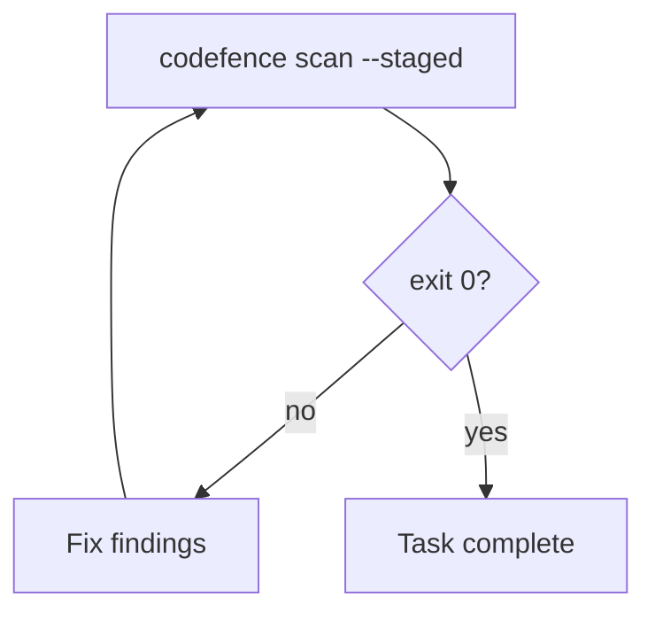

# Wiring Codefence guardrails into Cursor, Claude Code, and GitHub Copilot

Use **`codefence install`** in your application repository so assistants **automatically** run local scans — **without overwriting** your existing instructions.

## One-time setup (every application repo)

### 1. Install the CLI

```bash
npm install -D codefence
```

```json
{
  "scripts": {
    "codefence": "codefence scan --staged",
    "install:guardrails-ai": "codefence install"
  }
}
```

### 2. Install Git pre-commit (optional, recommended)

```bash
codefence install-hooks
```

Installs a **Node-based** `.git/hooks/pre-commit` (Windows, macOS, Linux). See [HOOKS.md](HOOKS.md).

### 3. Install assistant instructions (safe merge)

```bash
codefence install
```

Preview changes:

```bash
codefence install --dry-run
```

From the codefence repo without a global `codefence`:

```bash
# bash
./scripts/install-ai-rules.sh /path/to/your-app

# PowerShell
.\scripts\install-ai-rules.ps1 -TargetDir C:\path\to\your-app
```

#### What `codefence install` does

| Target | If missing | If you already have a file |
| ------ | ---------- | --------------------------- |
| `AGENTS.md` | Creates with codefence guardrails section | Appends or updates **only** the block between `<!-- codefence-guardrails:start -->` and `<!-- codefence-guardrails:end -->` |
| `.claude/CLAUDE.md` | Same (merged section) | Same |
| `.github/copilot-instructions.md` | Same (merged section) | Same |
| `.cursor/rules/codefence-guardrails.mdc` | Writes codefence guardrails rule | Updates **only** this file — **never** touches your other `.mdc` rules |
| `.gitignore` | Adds `.codefence/` | Appends `.codefence/` if missing |

Re-run `codefence install` after upgrading `codefence` to refresh the managed secrets block and `codefence-guardrails.mdc`.

---

## Cursor

`codefence install` adds **`.cursor/rules/codefence-guardrails.mdc`** with `alwaysApply: true`. Your existing rules stay untouched.

With the rule loaded, the agent should **automatically**:

- Run `codefence scan --staged` before completing tasks
- Fix any findings and re-run until exit 0

Optional nudge if it skips rules: "follow the codefence-guardrails markers in AGENTS.md".

---

## Claude Code

`codefence install` merges the codefence guardrails section into `.claude/CLAUDE.md` (or creates it). Content outside the `codefence-guardrails` HTML markers is preserved.

---

## GitHub Copilot

`codefence install` merges into `.github/copilot-instructions.md`. Copilot uses [repository custom instructions](https://docs.github.com/en/copilot/customizing-copilot/adding-repository-custom-instructions-for-github-copilot) for that repo.

---

## What happens on `codefence scan` failure



---

## Commands the LLM should run

| Step | Command | Stop when |
| ---- | ------- | --------- |
| Local guardrails | `codefence scan --staged` | Exit 0 |

---

## Verify the assistant is configured

Ask in chat:

```text
What are the guardrails steps before I can finish a task?
```

It should describe: run `codefence scan --staged`, fix findings, repeat until exit 0.

---

## This repository (codefence)

When developing this package locally, run:

```bash
npm install
npm run build
npm run codefence
npm run install:hooks
npm run install:ai
```

Package name on npm: `codefence`. CLI binary: `codefence`.
