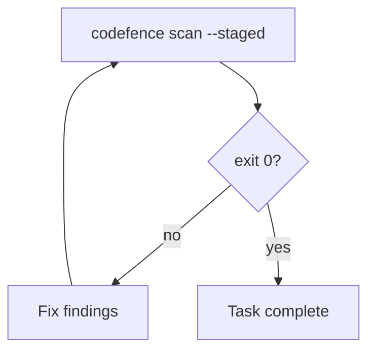

# Wiring Codefence guardrails into Cursor, Claude Code, and GitHub Copilot

Use **`codefence install`** in your application repository so assistants **automatically** run local scans — **without overwriting** your existing instructions.

## One-time setup (every application repo)

### 1. Install the CLI

Put the `codefence` binary on your `PATH` (see [README.md](../README.md)):

```bash
go install github.com/kadraman/codefence/cmd/codefence@latest
```

Or build from source:

```bash
CGO_ENABLED=0 go build -trimpath -ldflags="-s -w" -o codefence ./cmd/codefence
```

Then from your application repo:

```bash
codefence scan --staged
```

### 2. Install Git pre-commit (optional, recommended)

```bash
codefence install-hooks
```

Installs `.git/hooks/pre-commit` that invokes the `codefence` binary on `PATH` (Windows, macOS, Linux). See [hooks.md](hooks.md).

### 3. Install assistant instructions (safe merge)

```bash
codefence install
```

Preview changes:

```bash
codefence install --dry-run
```

#### What `codefence install` does

| Target | If missing | If you already have a file |
| ------ | ---------- | --------------------------- |
| `AGENTS.md` | Creates with codefence guardrails section | Appends or updates **only** the block between `<!-- codefence-guardrails:start -->` and `<!-- codefence-guardrails:end -->` |
| `.claude/CLAUDE.md` | Same (merged section) | Same |
| `.github/copilot-instructions.md` | Same (merged section) | Same |
| `.cursor/rules/codefence-guardrails.mdc` | Writes codefence guardrails rule | Updates **only** this file — **never** touches your other `.mdc` rules |
| `.gitignore` | Adds `.codefence/` | Appends `.codefence/` if missing |

Re-run `codefence install` after upgrading `codefence` to refresh the managed secrets block and `codefence-guardrails.mdc`.

---

## Cursor

`codefence install` adds **`.cursor/rules/codefence-guardrails.mdc`** with `alwaysApply: true`. Your existing rules stay untouched.

With the rule loaded, the agent should **automatically**:

- Prefer MCP tools (`scan`, `get_findings`, …) when `codefence mcp` is configured
- Otherwise run `codefence scan --staged` before completing tasks
- Fix any findings and re-run until exit 0
- Not ask you to run scans unless the `codefence` binary is missing

Optional nudge if it skips rules: "follow the codefence-guardrails markers in AGENTS.md".

---

## Claude Code

`codefence install` merges the codefence guardrails section into `.claude/CLAUDE.md` (or creates it). Content outside the `codefence-guardrails` HTML markers is preserved.

---

## GitHub Copilot

`codefence install` merges into `.github/copilot-instructions.md`. Copilot uses [repository custom instructions](https://docs.github.com/en/copilot/customizing-copilot/adding-repository-custom-instructions-for-github-copilot) for that repo.

---

## MCP (optional)

For long-lived agent sessions, run the stdio MCP server:

```bash
codefence mcp
```

When MCP is configured, agents should prefer MCP tools over repeatedly shelling out to `codefence scan`. See [`specs/features/012-mcp-server/`](../specs/features/012-mcp-server/).

---

## What happens on `codefence scan` failure



---

## Commands the LLM should run

| Step | Command | Stop when |
| ---- | ------- | --------- |
| Local guardrails (CLI) | `codefence scan --staged` | Exit 0 |
| Local guardrails (MCP) | MCP `scan` / `get_findings` (when configured) | No open findings |

---

## Verify the assistant is configured

Ask in chat:

```text
What are the guardrails steps before I can finish a task?
```

It should describe: run `codefence scan --staged` (or MCP tools when available), fix findings, repeat until exit 0.

---

## This repository (codefence)

When developing this binary locally:

```bash
go test ./...
CGO_ENABLED=0 go build -trimpath -ldflags="-s -w" -o codefence ./cmd/codefence
./codefence scan --staged
./codefence install-hooks
./codefence install
```

CLI binary: `codefence`.
